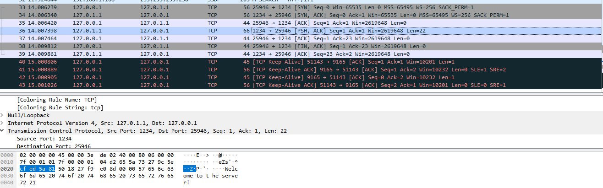

# Sockets in Python 3

Python’s socket module provides an interface to the Berkeley sockets API. This is the module that we’ll use and discuss in this tutorial.

The primary socket API functions and methods in this module are:

socket()
bind()
listen()
accept()
connect()
connect_ex()
send()
recv()
close()

We look at a simple socket example using server.py and client.py.  The wireshark screen shot shows the initial TCP connection
being setup then the message sent.  The server PORT of 1234 and client PORT 25946 
1.  SYN
2.  SYN/ACK
3.  ACK
4.  PSH, ACK (send the data "Welcome to the server")
5.  ACK
6.  FIN, ACK
7.  ACK

# Viewing socket state

To see the current state of all  sockets on the host

netstat -an

lsof gives you the COMMAND, PID (process id), and USER (user id) of open Internet sockets when used with the -i option.

lsof -i -n

# Buffer and streams

When we have message bigger than our buffer size and we wish to maintain the connection.  If the buffer is exceed the connction will close.  In order to overcome this we can use a HEADER.  This will tell the client how much data we are going to send.  A fixed length HEADER + msg. The first n bytes of data will be the header data, which will include the length of the message which the client will is to receive.

The following example:  bufferServer.py and bufferClient.py

# Sending and receiving objects

References:

Lesson learnt from:
* https://realpython.com/python-sockets/ 
* https://pythonprogramming.net/pickle-objects-sockets-tutorial-python-3
* and https://www.youtube.com/watch?v=Lbfe3-v7yE0

